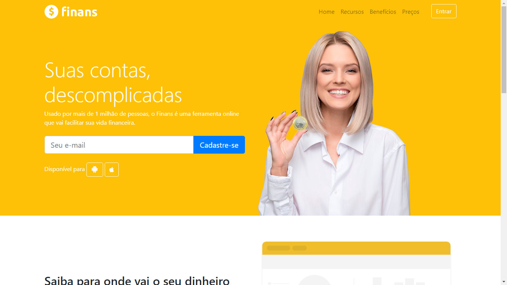
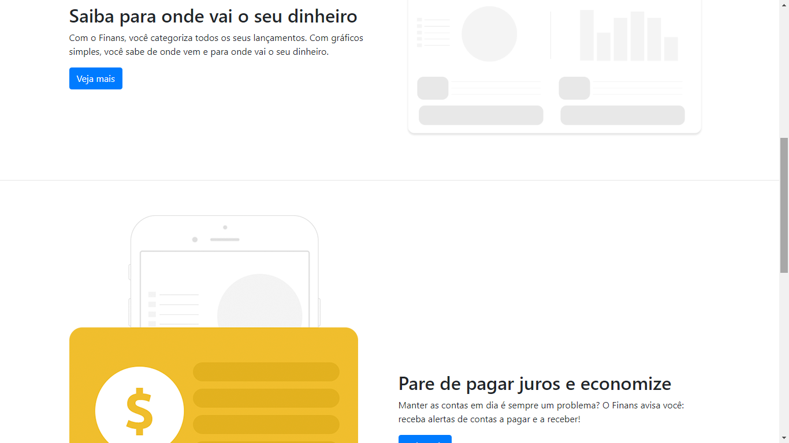
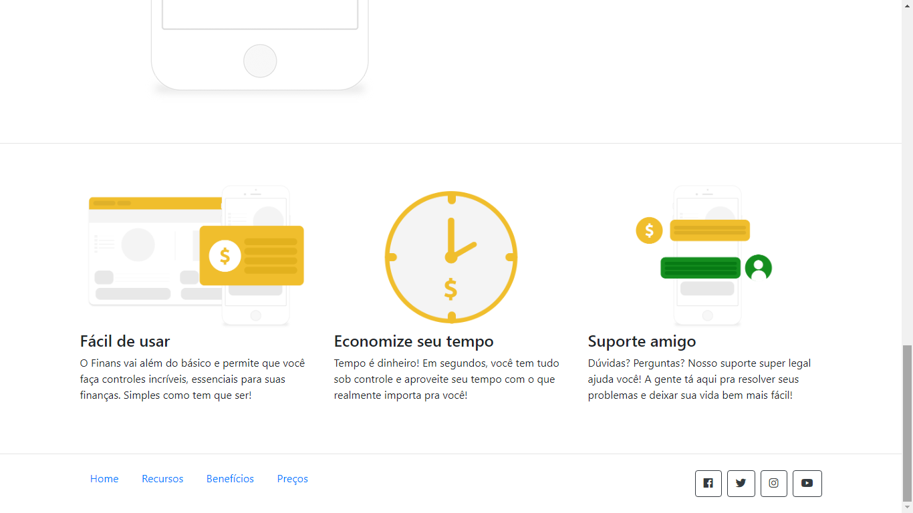

# Desafio-Front-end-Clark-Solutions

Finans - Projeto de estudos avançado de CSS, HTML, JavaScript e BootStrap

## Recursos

* O Desafio foi feito usando CSS, HTML, JavaScript e BootStrap.
* Foi aplicado tecnologias como display flex, responsividade, acessibilidade e muito mais.

## Uso

1. Clone o repositório do GitHub.
2. Abra o projeto no seu editor de código.
3. Abra o arquivo index.html (Página estática).

## Créditos

Este projeto foi criado por Alaska Websites.
